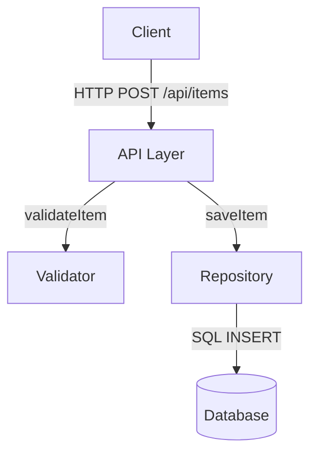

# Design Principles

Rules for generating `plan.md` architecture and interface definitions.

## Core principles

### Boundary-first architecture
Define boundary contracts BEFORE designing internal implementations. The interface is more important than the internals.

### Minimal surface area
- Expose only what is necessary at each boundary
- Prefer narrow interfaces over wide ones
- Add fields to contracts only when required by an acceptance criterion

### Test-driven architecture
- Every component design must include how it will be tested
- Integration test strategy must cross at least one boundary
- If a component is hard to test in isolation, the design is wrong

### No premature abstraction
- Implement the specific requirement first
- Extract to a shared abstraction only when a third use case appears
- Name abstractions after their actual behavior, not their hoped-for future use

## Diagram standards

All `plan.md` architecture diagrams MUST use Mermaid:



Rules for diagrams:
- Label all arrows with the operation or data type
- Show only components relevant to this spec's boundaries
- Use `[(name)]` for databases, `[name]` for services
- One diagram per boundary area if complex

## File Structure Plan rules

- List EVERY file to be created or significantly modified
- Use annotations: `← NEW`, `← MODIFY`, `← DELETE`
- Include test files (list before implementation files in each section)
- Group by boundary/module

## Interface contract format

```typescript
// Boundary: <Name>
// Input contract
type CreateItemInput = {
  name: string;        // max 255 chars
  categoryId: string;  // UUID format
};

// Output contract
type CreateItemResult =
  | { ok: true; item: Item }
  | { ok: false; error: 'invalid_category' | 'duplicate_name' };
```

- Use TypeScript types even for non-TypeScript projects (as documentation)
- Document constraints in comments (max length, format, etc.)
- Use discriminated unions for result types — avoid thrown exceptions at boundaries
