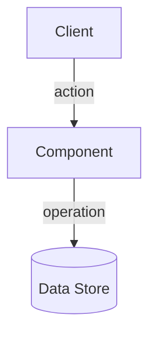

# Plan: {{FEATURE_NAME}}

## Architecture Overview

<!-- One paragraph: approach, key design decisions, how the feature fits in the existing system. -->

## Constitutional Gate Results

| Gate | Article | Result | Note |
|------|---------|--------|------|
| 1 | <!-- Article N — name --> | PASS | |

## Architecture Diagram



## Boundary Commitments

### Boundary: <!-- Name -->

_Owner:_ <!-- module or team -->  
_Consumers:_ <!-- who depends on this -->  
_Contract:_
- Input: <!-- type/shape -->
- Output: <!-- type/shape -->
- Side effects: none
- Error conditions: <!-- list -->

_Stability:_ stable

## File Structure Plan

```
<project root>/
├── src/
│   ├── <!-- new-file.ts -->    ← NEW: <!-- purpose -->
│   └── <!-- existing.ts -->   ← MODIFY: <!-- what changes -->
└── test/
    └── <!-- new-test.ts -->   ← NEW: <!-- what it tests -->
```

## Component Interfaces

```typescript
// Boundary: <!-- Name -->
// Input
type <!-- InputType --> = {
  // ...
};

// Output
type <!-- OutputType --> =
  | { ok: true; /* ... */ }
  | { ok: false; error: '<!-- error-code -->' };
```

## Data Models

<!-- Data structures introduced or modified -->

## Requirements Traceability

| AC ID | Scenario | Addressed by |
|-------|---------|-------------|
| 1.1 | Scenario 1 AC1 | <!-- file or component --> |

## Error Handling

<!-- How errors propagate across boundaries -->

## Testing Strategy

<!-- Integration test plan that crosses boundaries -->

## Open Questions Resolved

<!-- Clarifications from /aura-clarify that shaped this plan -->
